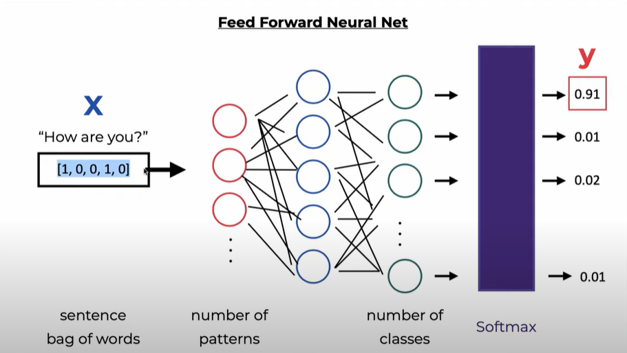

# Creating a Chat Bot With PyTorch

## What we will do

we're going to create a chatbot framework and conversational model for a custom database that i will train it on, the custom db will be about me, like who i'm and what i can do also what is teh skills that i have, so this chat bot can be customize by anyone and integrate it in his portfolio.

## what is the first step

A chatbot framework needs a structure in which conversational intents are defined. one of the cleanest way is with JSON file, like this:

```JSON
{
    "intents": [
        {"tag": "greeting",
         "patterns": ["Hi", "How are you", "Is anyone there?", "Hello", "Good day"],
         "responses": ["Hello, thanks for visiting", "Good to see you again", "Hi there, how can I help?"],
         "context_set": ""
        },
        {"tag": "goodbye",
         "patterns": ["Bye", "See you later", "Goodbye"],
         "responses": ["See you later, thanks for visiting", "Have a nice day", "Bye! Come back again soon."]
        },
        {"tag": "thanks",
         "patterns": ["Thanks", "Thank you", "That's helpful"],
         "responses": ["Happy to help!", "Any time!", "My pleasure"]
        }
   ]
}
```

Each conversational contains:

- **Tag:** unique name
- **Patterns:** sentence patterns for our neural network text classifier
- **responses:** one will be used as a response

## Terminology and step by step to create this project

1. **Tokenization**
   - Input: "Is anyone there?"
   - Output: `["Is", "anyone", "there", "?"]`

2. **Lowercasing and Stemming**
   - Process the tokens by converting to lowercase and then applying stemming (if necessary).
   - Output remains: `["is", "anyone", "there", "?"]`

3. **Removing Punctuation Characters**
   - Exclude punctuation from tokens.
   - Output: `["is", "anyone", "there"]`

4. **Bag of Words**
   - Convert the tokens into a numerical format known as a bag of words.
   - Output Vector: `[0, 0, 0, 1, 0, 1, 0, 1]`

### 1. Create the utils.py

- Create the tokenize function

```python
tokenize function split sentence into array of words/tokens
a token can be a word or punctuation character, or number
```

- Create the stem function

```python
stemming = find the root form of the word
    examples:
    words = ["organize", "organizes", "organizing"]
    words = [stem(w) for w in words]
    -> ["organ", "organ", "organ"]
```

- create the bag_of_words function

```python
return bag of words array:
    1 for each known word that exists in the sentence, 0 otherwise
    example:
    sentence = ["hello", "how", "are", "you"]
    words = ["hi", "hello", "I", "you", "bye", "thank", "cool"]
    bag   = [  0 ,    1 ,    0 ,   1 ,    0 ,    0 ,      0]
```

our model will work like this



So let's go and build our own chatbot from scratch

### Release 2

after noting that our chatbot is very week and he can handle just a few question we will add some pre trained model and also adding the Azure openAI API for a dynamic response.

so we will integrate both **Azure OpenAI API** and my **Custom Intent-based system**

1. **To Handle Static Intents:** we will use custom `intents.json` file for predefined responses when intent is clear.
2. **To handle Dynamic Response:** when the chatbot cannot confidently identify an intent, it will send the user's query to the Azure OpenAi API for a dynamic response.
